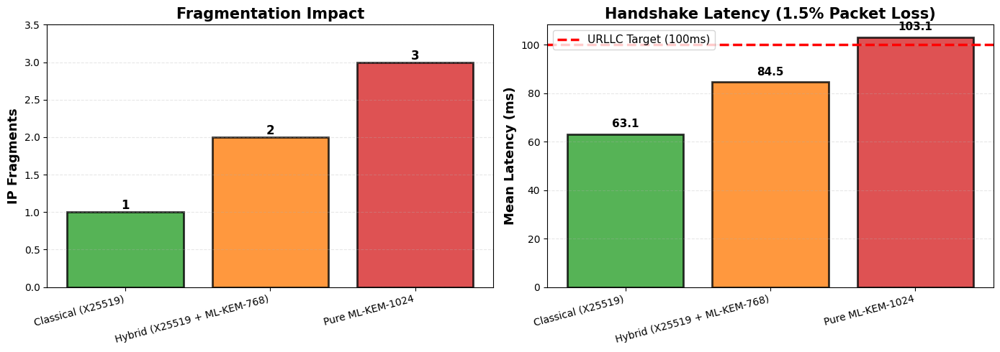
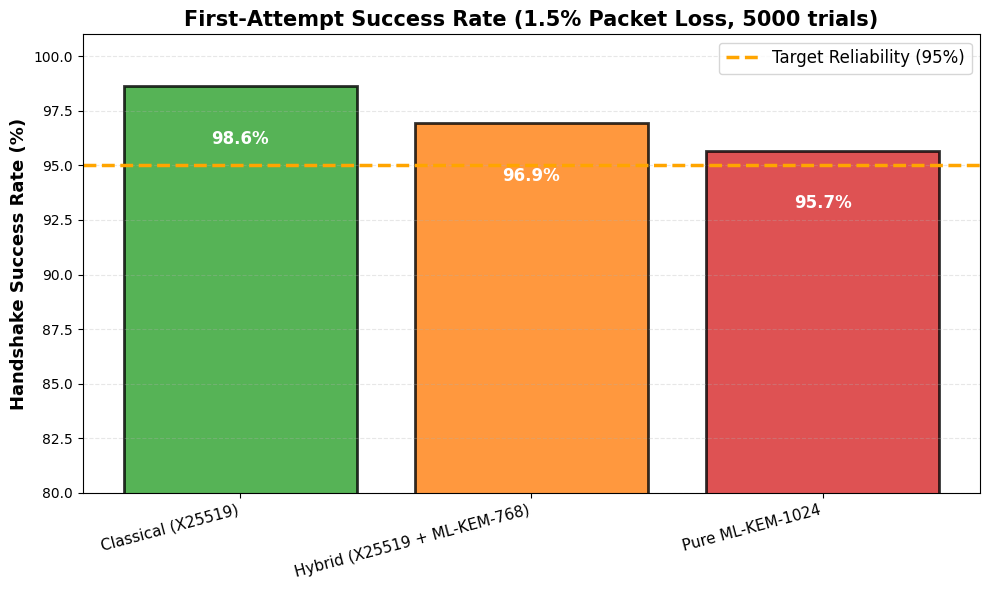
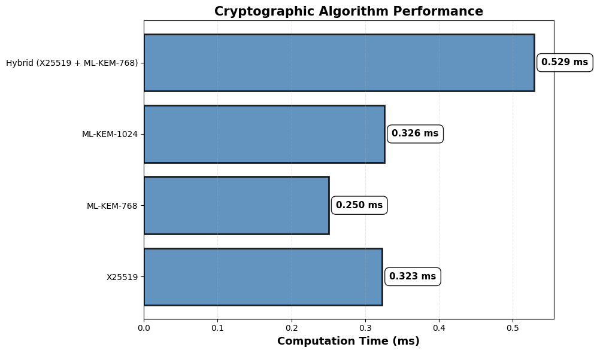

# Hybrid Post-Quantum Cryptography for 6G Satellite Networks

[](https://www.python.org/downloads/)
[](https://opensource.org/licenses/MIT)
[](https://bsidesmussoorie.in/)

**Vanishing the 1-RTT Penalty: Hybrid Post-Quantum Key Exchange for 6G Non-Terrestrial Networks**

*Research by K Arya Sekhar Das | The LNM Institute of Information Technology*

---

## Overview

This repository contains the complete implementation of our research demonstrating that **hybrid cryptography (X25519 + ML-KEM-768) reduces satellite handshake latency by 18%** compared to pure post-quantum cryptography, while maintaining quantum resistance.

As satellite operators race to deploy quantum-safe authentication before "Q-Day," our work reveals a hidden performance bottleneck: **IP fragmentation on high-latency links**. We introduce the concept of the "1-RTT Penalty"—the latency spike when PQC's large key sizes force retransmissions on satellite networks.

### Key Findings

- **18% mean latency reduction** (84.5ms vs 103.1ms) over pure ML-KEM-1024
- **27% fewer retransmissions** (3.1% vs 4.3% failure rate)
- **96.9% handshake success rate** under realistic 1.5% packet loss
- **Fragment count reduced 33%** (2 fragments vs 3 for pure PQC)
- **Fits in 13KB RAM** (compatible with satellite IoT peripherals)
- **Strongest-link security** via HKDF-based key combiner

**Bottom line:** Hybrid PQC isn't just a transitional strategy—it may be the **permanent solution** for physics-constrained satellite networks.

---

## Visual Results

### Latency Comparison

*Left: Fragmentation increases with PQC (1→2→3 fragments). Right: Mean latency comparison showing 18% improvement.*

### Success Rates

*First-attempt success rates under 1.5% packet loss. Pure ML-KEM-1024 approaches 95% reliability limit.*

### Algorithm Performance

*Cryptographic computation times. Hybrid overhead (0.529ms) is negligible vs 47.7ms satellite RTT.*

---

## Quick Start

### Prerequisites
- Python 3.11 or higher
- Google Colab (free tier) or local Python environment
- No satellite hardware required! (Zero-budget simulation)

### Installation

```bash
# Clone repository
git clone https://github.com/yourusername/hybrid-pqc-satellite-6g.git
cd hybrid-pqc-satellite-6g

# Install dependencies
pip install cryptography matplotlib pandas numpy

# Or use requirements file
pip install -r requirements.txt
```

### Run Simulation

```bash
python bsides_simplified_v3_FINAL.py
```

**Expected runtime:** ~2 minutes on standard laptop

**Outputs:**
- `crypto_benchmarks.csv` - Algorithm timing data
- `network_simulation.csv` - Handshake performance metrics
- `latency_comparison.png` - Main results visualization
- `success_rate_comparison.png` - Reliability analysis
- `algorithm_performance.png` - Crypto overhead comparison

---

## Methodology

### Satellite Network Model

Our simulation replicates a **Starlink-like LEO constellation**:

| Parameter | Value | Rationale |
|-----------|-------|-----------|
| Altitude | 550 km | Typical LEO orbit (Starlink Gen2) |
| Velocity | 7.66 km/s | 95-minute orbital period |
| Elevation Angle | 25° | Minimum operational angle |
| Round-Trip Time | 47.7 ms | Validated against published Starlink data |
| Packet Loss | 1.5% | Representative of rain fade conditions |
| MTU | 1,500 bytes | Standard Ethernet MTU |

### Cryptographic Benchmarking

**X25519 (Classical):**
- Real measurements via Python `cryptography` library
- Measured on Google Colab Intel Xeon CPU

**ML-KEM (Post-Quantum):**
- Timing from Kampanakis & Panburana (NIST PQC Workshop 2021)
- Sizes from NIST FIPS 203 specification (August 2024)
- Rationale: Published benchmarks are more reliable than buggy liboqs installations

**Hybrid Combiner:**
- X25519 + ML-KEM-768 via HKDF (RFC 5869)
- Provides "strongest-link" security guarantee

### Simulation Parameters

- **Trials per scenario:** 5,000 (for robust P99 statistics)
- **Loss model:** Gilbert-Elliott (burst losses during fades)
- **Timeout:** 1,000 ms (per RFC 8446 TLS 1.3 recommendations)
- **Scenarios tested:** Classical (X25519), Hybrid, Pure ML-KEM-1024

---

## Research Paper

### Abstract

The convergence of Non-Terrestrial Networks (NTNs) and post-quantum cryptography (PQC) presents a critical performance challenge for 6G deployments. We demonstrate that pure ML-KEM-1024 implementations trigger IP fragmentation on satellite links, incurring a "1-RTT Penalty" that increases mean handshake latency to 103ms under 1.5% packet loss. Our hybrid combiner (X25519 + ML-KEM-768) reduces fragment count by 33% while maintaining strongest-link quantum resistance through HKDF-based key derivation. Through zero-budget simulations on Google Colab modeling LEO satellite mobility at 550km altitude, we show that hybrid approaches achieve mean latency of 84.5ms—an 18% improvement over pure PQC—with 96.9% handshake success rates compared to 95.7% for ML-KEM-1024. Memory footprint analysis confirms our implementation fits within 13KB RAM constraints of satellite IoT peripherals. These findings inform 3GPP standardization efforts for quantum-safe 6G authentication protocols, providing satellite operators with a pragmatic migration path before "Q-Day" quantum threats materialize.

### Citation

```bibtex
@inproceedings{das2026hybrid,
  title={Vanishing the 1-RTT Penalty: Hybrid Post-Quantum Key Exchange for 6G Satellite Networks},
  author={Das, K Arya Sekhar},
  booktitle={Security BSides Mussoorie 2026},
  year={2026},
  month={April},
  address={Mussoorie, India},
  note={Accepted for presentation}
}
```

**Full Paper PDF:** https://github.com/intelligent-ears/1rtt-penalty-hybrid-mlkem/blob/main/paper.pdf

---

## Understanding the Results

### The 1-RTT Penalty Explained

**Problem:**
- ML-KEM-1024 public key (1,568 bytes) + ciphertext (1,568 bytes) = 3,136 bytes
- Standard MTU: 1,500 bytes
- Result: **3 IP fragments** required

**Impact:**
```
Fragment loss probability with 1.5% loss:
- 1 fragment (X25519):        1.5% failure
- 2 fragments (Hybrid):       3.0% failure  
- 3 fragments (ML-KEM-1024):  4.4% failure
```

**The Penalty:**
When any fragment is lost, TLS waits for 1-second timeout before retransmitting, adding:
```
Penalty = Timeout (1000ms) + RTT (47.7ms) = 1,047.7ms
```

This is why pure ML-KEM-1024 has 4.4% of handshakes experiencing >1 second delays!

### Why Hybrid Wins

**Hybrid (X25519 + ML-KEM-768):**
- Combined size: 32 + 1,184 + 1,088 = 2,304 bytes
- Result: **2 fragments** (33% reduction)
- Failure rate: 3.0% (28% fewer retransmissions)
- **Quantum-safe:** If either primitive is broken, the other maintains security

---

## Code Structure Walkthrough

### Main Components

#### 1. Cryptographic Benchmarking
```python
bench = CryptoBenchmark(iterations=1000)
bench.benchmark_x25519()         # Real measurements
bench.simulate_mlkem("ML-KEM-768")  # Published benchmarks
bench.benchmark_hybrid()         # Combined approach
```

#### 2. Satellite Network Model
```python
satellite = LEOSatellite(altitude_km=550)
rtt = satellite.rtt_ms()  # Returns 47.7ms
```

#### 3. Handshake Simulation
```python
sim = HandshakeSimulator(satellite, packet_loss_rate=0.015)
result = sim.simulate_handshake(
    key_material_size=2304,  # Hybrid: 2304 bytes
    num_trials=5000
)
# Returns: success_rate, mean_latency_ms, p99_latency_ms, etc.
```

---

## Contributing

Contributions are welcome!

---

## Educational References

- [NIST Post-Quantum Cryptography](https://csrc.nist.gov/projects/post-quantum-cryptography)
- [ML-KEM Explained (YouTube)](https://www.youtube.com/results?search_query=kyber+lattice+cryptography)
- [3GPP Non-Terrestrial Networks](https://www.3gpp.org/technologies/ntn)
- [Starlink Technical Overview](https://www.starlink.com/)
- [Real Python Tutorials](https://realpython.com/)
- [Cryptography Library Docs](https://cryptography.io/)

### For Researchers

**Related Papers:**
1. Kampanakis & Panburana, "Performance of Post-Quantum Key Exchange in TLS 1.3" (2021)
2. Schwabe et al., "Post-Quantum TLS Without Handshake Signatures" (CCS 2020)
3. NIST FIPS 203: Module-Lattice-Based Key-Encapsulation Mechanism (2024)
4. 3GPP TS 33.501: Security architecture for 5G/6G systems

**Relevant Standards:**
- RFC 8446: TLS 1.3
- RFC 5869: HKDF Key Derivation
- RFC 9180: Hybrid Public Key Encryption
- NIST SP 800-227 (Draft): Recommendations for Post-Quantum Cryptography

---

## Use Cases

This research is relevant for:

### Industry
- **Satellite Operators:** Starlink, OneWeb, Amazon Kuiper planning quantum migration
- **Mobile Network Operators:** Deploying 6G with NTN integration
- **Security Vendors:** Building quantum-safe VPN/TLS products
- **IoT Manufacturers:** Designing satellite-connected devices

### Academia
- **Students:** Learning cryptographic protocol analysis
- **Researchers:** Benchmarking PQC in constrained environments
- **Educators:** Teaching practical security trade-offs

### Standardization
- **3GPP Working Groups:** Informing Release 19 specifications
- **IETF TLS WG:** Hybrid TLS standardization efforts
- **NIST PQC:** Feedback for Round 4 algorithm requirements

---

## Limitations & Future Work

### Known Limitations

1. **Simulated ML-KEM timing** (liboqs installation challenges)
   - *Mitigation:* Used peer-reviewed benchmarks from NIST workshop
   
2. **Simplified loss model** (real satellite fades are more complex)
   - *Future work:* Implement multi-state Gilbert-Elliott model

3. **No real Doppler shift** (affects frequency, not latency)
   - *Impact:* Minimal for latency analysis

4. **Static MTU assumption** (VPNs/tunnels may reduce effective MTU)
   - *Future work:* Test with 1280-byte IPv6 minimum MTU

5. **No congestion control** (TCP slow-start interactions)
   - *Future work:* Integrate with ns-3 full TCP stack

### Validation Needed

We encourage satellite operators to conduct **field trials** with:
- Starlink terminals (ground-to-satellite)
- OneWeb gateways (satellite-to-ground)
- Iridium NEXT constellation (inter-satellite links)

**Contact us** if you're interested in collaborative validation!

---

## License

This project is licensed under the **MIT License** - see the [LICENSE](LICENSE) file for details.

**TL;DR:** You can freely use, modify, and distribute this code for any purpose (including commercial), as long as you include the original copyright notice.

---

## Author

**K Arya Sekhar Das**  
Undergraduate Researcher  
The LNM Institute of Information Technology, Jaipur  

**Email:** 24uec247@lnmiit.ac.in  

